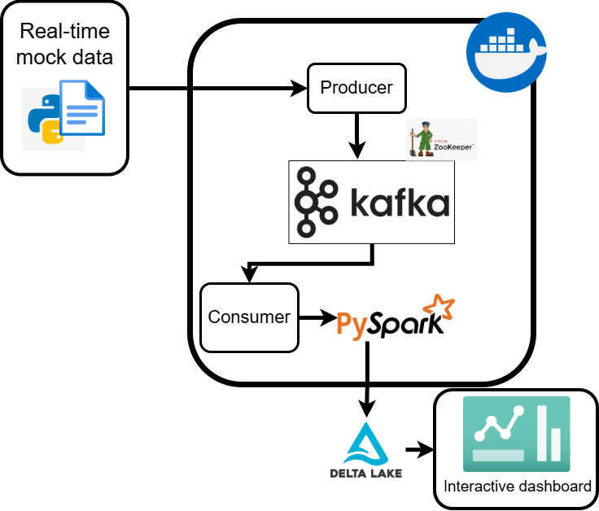

# Callcenter ML Streaming Project

Real time events processing pipeline utilizing Apache Kafka, PySpark for ETL
data processing and big data analysis, saving the data in a Delta Lake format. Then I made an interactive dashboard
utilizing Power BI to present the results.  

## Project architecture
- **Python**: Data producing script;
- **Apache Kafka**: Real time event ingestion;
- **Apache Spark**: Processing engine for transformation and aggregation of data;
- **Delta Lake**: Data storage for ACID transactions, saving the data locally;
- **Power BI**: Dashboard viewing tool for navegation metrics.

## Used technologies
* Python 3.x
* Apache Kafka
* Docker & Docker Compose
* PySpark
* Power BI
* Scikit-learn

## How to run
1. Clone the repo: `git clone ...`
2. Install dependencies with pip: `pip install -r requirements.txt`
3. Up Kafka with Docker Compose: `docker-compose up -d`
4. Run the producer: `python producer.py`
5. Run the consumer (another terminal): `python spark_processor.py`

## Schema

## Dashboard

## Technical note: manual refresh
Due to Power BI native limitation where auto refresh is only available for DirectQuery connections, this dashboard uses Import Mode to read the local Delta/Parquet files. While the Spark pipeline processes data in real-time, the dashboard requires a manual refresh to pull the latest processed batches from the local disk. In a cloud production environment, this would be bypassed using DirectQuery or streaming datasets.