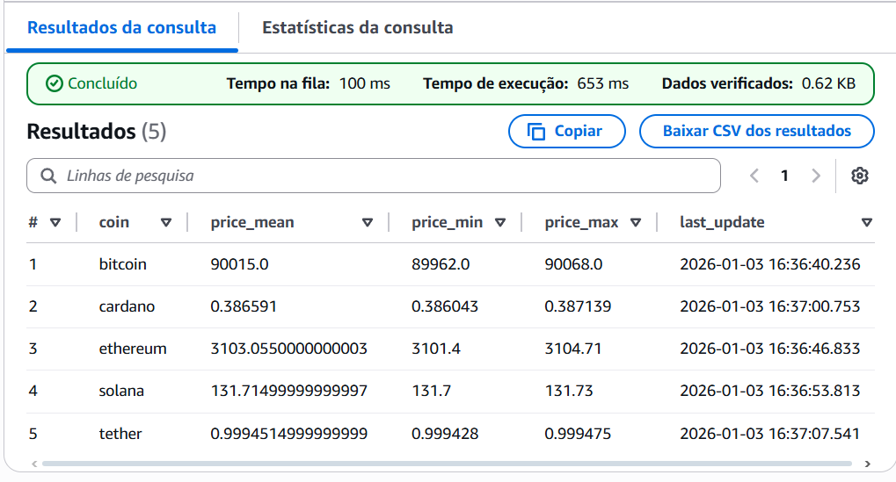

# Crypto Medallion Data Pipeline: Airflow, S3 & Athena

An automated data pipeline for monitoring and analyzing cryptocurrency prices (BTC, ETH, SOL, ADA. This project implements a Medallion Architecture to organize a Data Lake on AWS, ensuring data integrity from raw extraction to the final analytical layer.

## Project Architecture
* Airflow (Docker): The orchestrator managing extraction and transformation tasks.
* Python (Boto3/Pandas): Used for data extraction from the CoinGecko API and as the core transformation engine.
* Amazon S3: Scalable data lake divided into layers (Bronze, silver and gold).
* AWS Athena: Serverless query engine used to analyze data directly in S3 using standard SQL.
* Terraform: Infrastructure as Code (IaC) to provision buckets and security policies.

## Technologies Used
* Python 3.x
* Apache Airflow (Dockerized)
* Pandas & PyArrow (Parquet)
* AWS (S3, Athena)
* Terraform
* Boto3

## Data Pipeline Layers
* Bronze (Raw): Raw JSON data preserving the original API response.
* Silver (Cleaned): Data converted to Parquet format, typed, and sanitized.
* Gold (Analytics): Daily aggregations with price metrics (averages, maximums, and minimums).

## How to Run
1. Clone the project (or the whole repository if you wish to): 
git clone --no-checkout https://github.com/vh141201/projetos.git
cd projetos
git sparse-checkout set "2.Data_platforms_&_orchestration/BatchCriptoAPI"
git checkout main

2. Navigate to this project folder: cd "2.Data_platforms_&_orchestration/BatchCriptoAPI"
3. Set up Airflow Variables: Add aws_access_key and aws_secret_key via the Airflow UI.
4. Start the Docker environment: docker-compose up -d
5. Infrastructure Deploy (Optional): Navigate to the terraform folder and run terraform apply.
6. Enable the DAG: Activate extraction_crypto_api_to_s3 in the Airflow dashboard.

## Schema

## Analysis & Evidence

## Technical Note: Security & Scalability
This project utilizes Airflow Variables to ensure AWS credentials are never exposed within the codebase. Communication between the local Docker container and the AWS Cloud is handled securely via Boto3. The use of .parquet data files in the silver layer enables AWS Athena to perform queries by leveraging columnar storage and partitioning by coin.